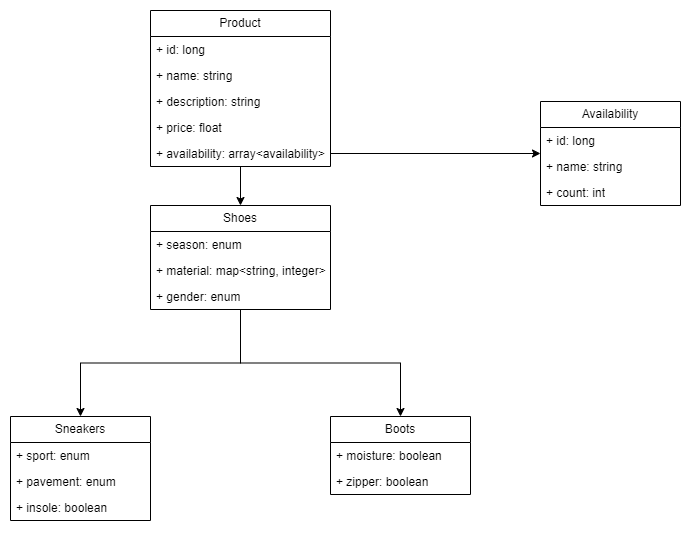

# Демопроект Vespa

---

### Описание проекта 
Представим, что мы хотим создать хранилище для нашего магазина, который торгует продуктами и техникой.
Мы хотим получить от системы максимальную производительность в рамках поиска нужного товара. 
Для этого мы воспользуемся Vespa.

В этом проекте представлена самая простая конфигурация Vespa.

Пример запросов на добавление, чтение и фильтрацию результирующих полей:
* [VegetablesVespaTests.java](vespa-app%2Fsrc%2Ftest%2Fjava%2Fru%2Fsportmaster%2FVegetablesVespaTests.java)
* [VespaPhoneTests.java](vespa-app%2Fsrc%2Ftest%2Fjava%2Fru%2Fsportmaster%2FVespaPhoneTests.java)

Схема данных:



### Шаги для сборки и развертывания Vespa

1. Скачать и установить Docker - https://www.docker.com/
2. Скачать и установить Vespa CLI - https://github.com/vespa-engine/vespa/releases
3. Запустить контейнер с конфигурационным сервером
    ```shell 
    docker-compose up -d --build --force-recreate
    ```
4. Собрать модуль c конфигурацией Vespa
    ```shell
    mvn -f ./vespa-config/pom.xml clean install 
    ```
5. Развернуть конфигурацию на сервер
    ```shell
    vespa deploy ./vespa-config --wait 600
    ```